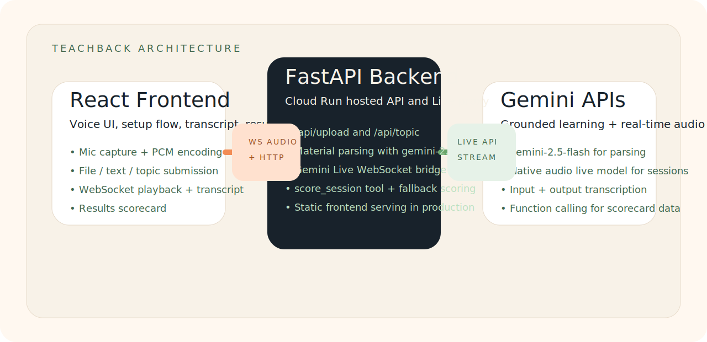

# TeachBack

TeachBack is a real-time AI learning companion that helps you understand topics by talking them through out loud.

## The Problem

Passive learning is sticky in the moment but weak over time. Re-reading notes, watching lectures, and skimming summaries can feel productive without proving that the material is actually understood. Research-backed active learning techniques do a much better job at exposing weak spots and improving retention.

## The Solution

TeachBack turns studying into a live voice conversation. Instead of passively consuming material, the learner explains, recalls, and reasons out loud while an AI persona responds in real time. The app uses proven techniques like the Feynman Technique, Socratic questioning, active recall, and interactive instruction to make understanding visible.

## Learning Modes

- **Explain Mode**: The user explains the topic while the AI probes for gaps using the Feynman Technique.
- **Socratic Mode**: The AI only asks guiding questions so the learner has to discover the answer themselves.
- **Recall Mode**: The AI conversationally quizzes the user on uploaded material to test retention.
- **Teach Mode**: The AI teaches the uploaded material interactively and checks understanding as it goes.

## Demo Video

Add your demo link here after recording.

## Architecture Diagram



## Tech Stack

- Frontend: Vite, React, TanStack Query, Tailwind CSS, Web Audio API
- Backend: Python, FastAPI, Google GenAI SDK (`google-genai`), PyPDF2, Uvicorn
- Infrastructure: Docker, Google Cloud Run

## Setup Instructions

### Prerequisites

- Node.js 20+
- Python 3.11+
- A Google API key with access to Gemini

### Local Setup

```bash
git clone <your-repo-url>
cd gemini-live-api
cp .env.example .env
```

Fill in `GOOGLE_API_KEY` inside `.env`.

### Backend

```bash
python3 -m venv .venv
source .venv/bin/activate
pip install -r requirements.txt
uvicorn server.main:app --reload
```

### Frontend

```bash
cd client
npm install
npm run dev
```

The Vite frontend runs on `http://localhost:5173` and talks to the FastAPI backend on `http://localhost:8000` by default.

## Deployment

```bash
chmod +x deploy.sh
./deploy.sh
```

## Google Cloud Services Used

- Cloud Run

## Gemini Models Used

- `gemini-2.5-flash` for material parsing, topic generation, and fallback scoring
- `gemini-2.5-flash-native-audio-preview-12-2025` for live voice sessions

## Notes

- The app supports PDF, image, pasted text, and topic-only inputs.
- Input and output transcription are enabled during live sessions.
- The live session uses function calling for structured score output.
- There is a fallback scoring safety net: if the live model does not call `score_session` after the user ends a session, the backend computes the same score schema from the transcript with `gemini-2.5-flash`.
